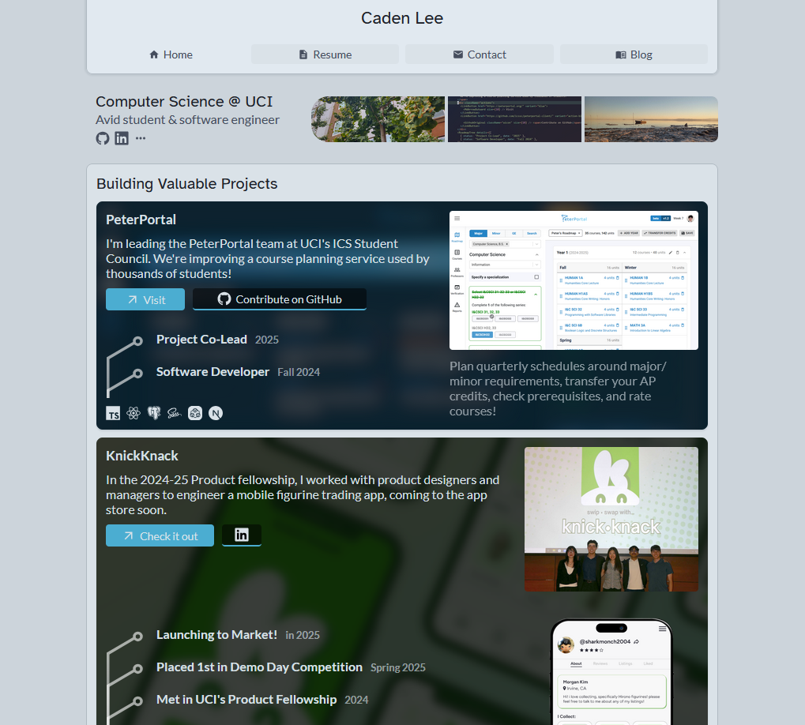

# Personal Website

This is the latest version of my personal website.


## Development
Running the frontend is simple:
```
cd frontend
npm install
npm run dev
```

## Stack & tools
- React + Vite
- Material icons (from `react-icons`) and Devicons

## Future goals
- Personal availability calendar/meeting scheduler based on [rical](https://github.com/Cadecraft/rical)
- Restaurant rating map
- More blog posts

## License
See the included LICENSE.txt file for more information.
