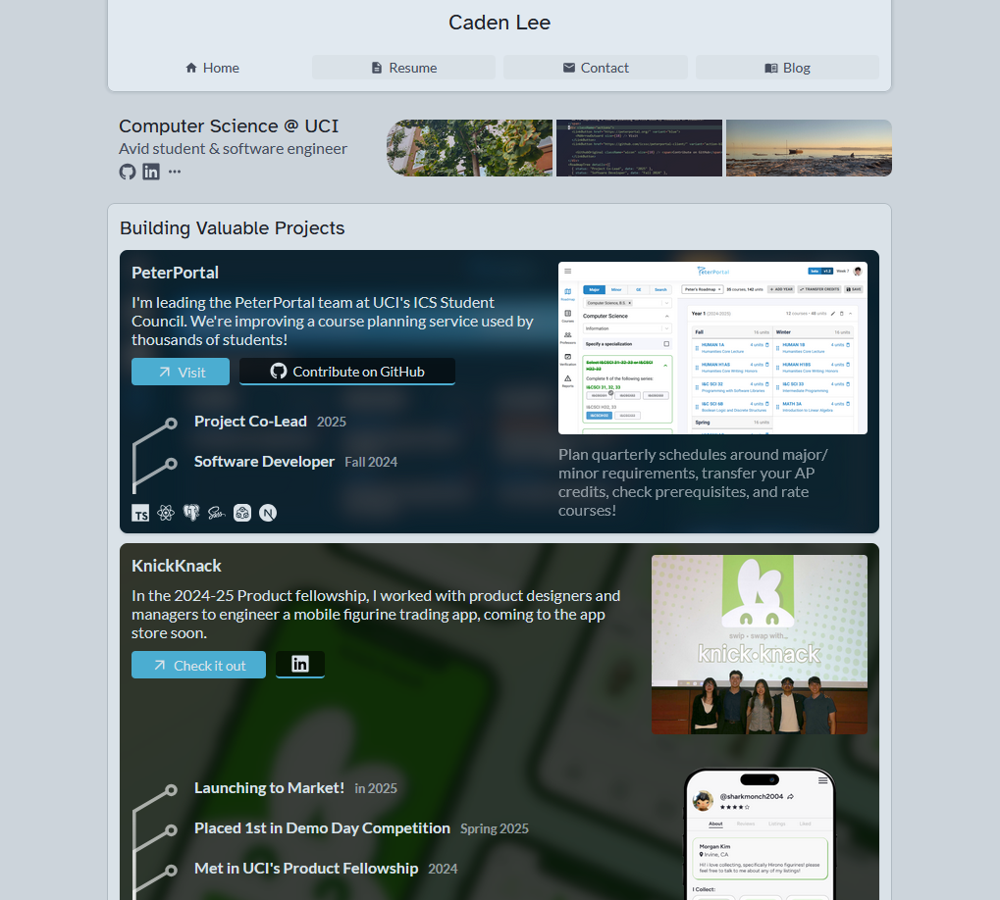

# Personal Website

This is the latest version of my personal website, hosted at <https://cadenlee.dev>.



## Development
Running the frontend is simple:
```sh
cd frontend
npm install
npm run dev
```

## Stack & tools
- React + Vite
- Material icons (from `react-icons`) and Devicons

## Future goals
- ~~Restaurant rating map~~ ([done](https://cadenlee.dev/cuisine)!)
- Personal availability calendar/meeting scheduler based on [rical](https://github.com/Cadecraft/rical)
- More blog posts
- Self-hosted markdown notes

## License
See the included LICENSE.txt file for more information.
