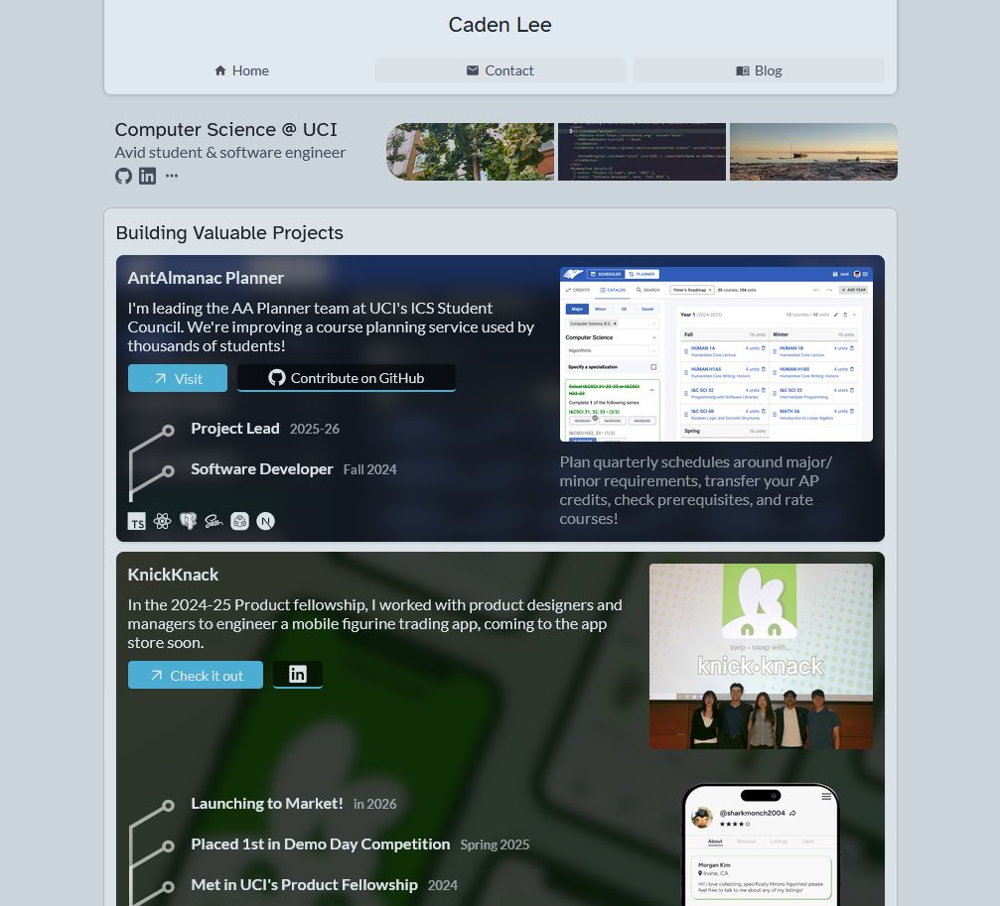

# Personal Website

This is the latest version of my personal website, hosted at <https://cadenlee.dev>.



## Development
This project uses `pnpm`, which you can install via `npm i -g pnpm`.

Running the frontend is simple:
```sh
cd frontend
pnpm install
pnpm dev
```

## Stack & tools
- SolidJS, using SolidStart + Vite
- Material icons and Devicons

## Features & future goals
- ~~Restaurant rating map~~ ([done](https://cadenlee.dev/cuisine)!)
- ~~RSS feed~~ ([done](https://cadenlee.dev/rss.xml)!)
- Personal availability calendar/meeting scheduler based on [rical](https://github.com/Cadecraft/rical)
- More blog posts
- ~~Self-hosted markdown notes~~ ([done](https://notes.cadenlee.dev/misc/example)!)

## License
See the included LICENSE.txt file for more information.
